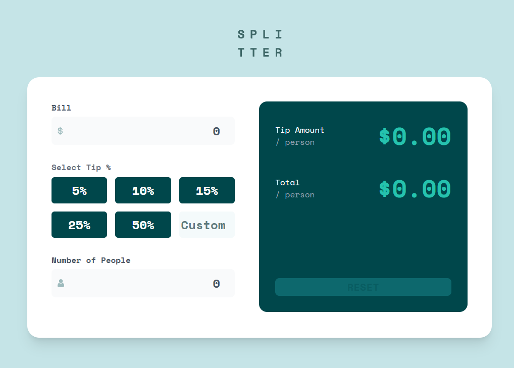
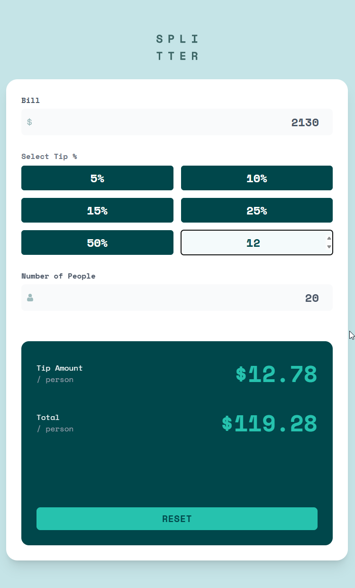
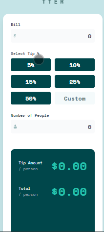

# Frontend Mentor - Tip calculator app solution

This is a solution to the [Tip calculator app challenge on Frontend Mentor](https://www.frontendmentor.io/challenges/tip-calculator-app-ugJNGbJUX). Frontend Mentor challenges help you improve your coding skills by building realistic projects.

## Table of contents

- [Overview](#overview)
  - [The challenge](#the-challenge)
  - [Screenshot](#screenshot)
  - [Links](#links)
- [My process](#my-process)
  - [Built with](#built-with)
  - [What I learned](#what-i-learned)
  - [Continued development](#continued-development)
  - [Useful resources](#useful-resources)
  - [AI Collaboration](#ai-collaboration)
- [Author](#author)
- [Acknowledgments](#acknowledgments)

## Overview

### The challenge

Users should be able to:

- View the optimal layout for the app depending on their device's screen size
- See hover states for all interactive elements on the page
- Calculate the correct tip and total cost of the bill per person

### Screenshot



*Desktop*



*Tablet*



*Mobile*

### Links

- Live Site URL: [Add live site URL here](https://your-live-site-url.com)

## My process

### Built with

- Semantic HTML5 markup
- CSS custom properties
- Flexbox
- CSS Grid
- Mobile-first workflow
- [React](https://react.dev/) - JS library
- [TypeScript](https://www.typescriptlang.org/) - Typed JavaScript
- [Vite](https://vite.dev/) - Build tool
- [Tailwind CSS](https://tailwindcss.com/) - Utility-first CSS framework

### What I learned

This project was my first time wiring up multiple React components through props and shared state. The biggest lesson was understanding **controlled components** and one-way data flow: state lives in `App`, flows down as props, and changes flow back up through callback functions.

I learned how to make radio buttons controlled with `checked` instead of `value`:

```tsx
<input
  type="radio"
  value={option}
  checked={option === value}
  onChange={() => handleRadioChange(option)}
/>
```

I also learned the difference between **shared state** and **local state**. The Custom tip input initially mirrored the shared `value` prop, which caused the selected tip percentage to appear inside the Custom box. The fix was giving that input its own `useState` inside the component — it only reports the final number upward, while owning what's displayed locally.

For the calculations, I used **derived values** instead of `useState`. Since the tip and total can be calculated from existing state, storing them separately would risk them getting out of sync:

```tsx
const tipPerPerson =
  nrOfPeople > 0 ? (billAmount * (tipPercentage / 100)) / nrOfPeople : 0;
```

Finally, I learned to guard against division by zero — without the `nrOfPeople > 0` check, the display showed `Infinity` or `NaN`.

### Continued development

In future projects I want to keep focusing on:

- Deciding when state should be local to a component vs. lifted to a parent
- Form validation patterns and error messaging (the "Can't be zero" state was a good introduction)
- Converting more of the styling to reusable components so Tailwind class strings stay shorter
- Getting faster at reading TypeScript compiler errors — `npx tsc --noEmit` became my favorite debugging tool during this project

### Useful resources

- [React Docs – Thinking in React](https://react.dev/learn/thinking-in-react) - Helped me understand where state should live and how data flows through the component tree.
- [MDN – Radio input](https://developer.mozilla.org/en-US/docs/Web/HTML/Element/input/radio) - Cleared up why radios use `checked` rather than `value` for the selected state.
- [MDN – toFixed()](https://developer.mozilla.org/en-US/docs/Web/JavaScript/Reference/Global_Objects/Number/toFixed) - Used for formatting the currency output to two decimal places.

### AI Collaboration

- **Tools used:** opencode (AI coding assistant)
- **How I used it:** I used it as a mentor while building the project — it reviewed my code, gave hints when I got stuck (like the controlled radio button pattern and the shared vs. local state bug), and helped me plan the remaining work. When I asked it to write the code for me, it pushed back and had me implement the changes myself so the concepts would stick.
- **What worked well:** The hint-based approach meant I actually understood each piece rather than pasting in code I didn't understand. Running `npx tsc --noEmit` after each change, which it suggested, caught type mismatches early.

## Author

- Website - [Add your name here](https://www.your-site.com)
- Frontend Mentor - [@yourusername](https://www.frontendmentor.io/profile/yourusername)
- Twitter - [@yourusername](https://www.twitter.com/yourusername)

## Acknowledgments

Thanks to the Frontend Mentor community for the challenge designs and style guide, and to the AI assistant that kept me accountable and walked me through the trickier React concepts instead of handing me the answers.
